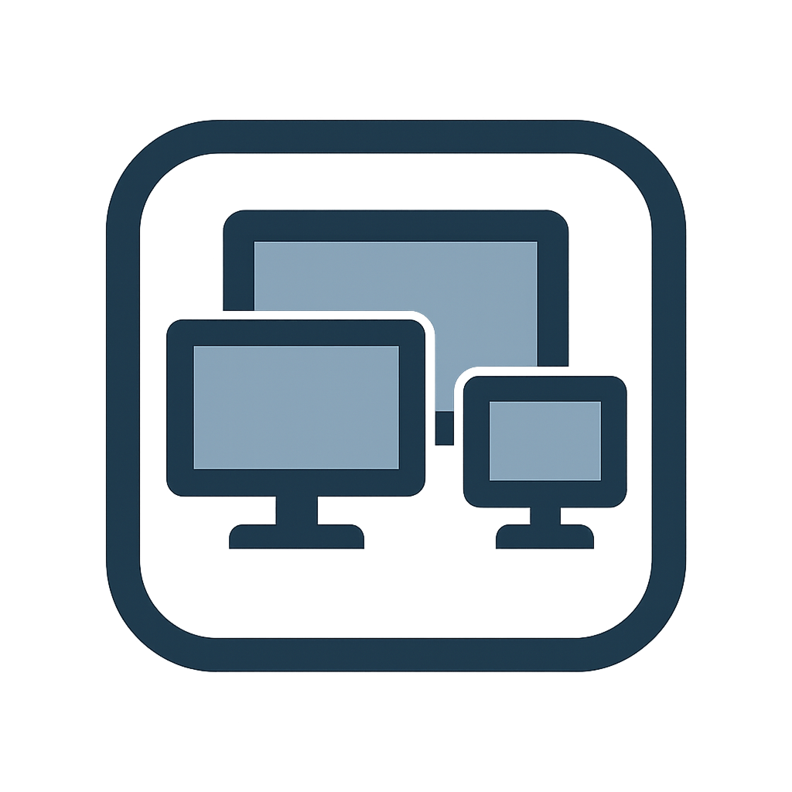
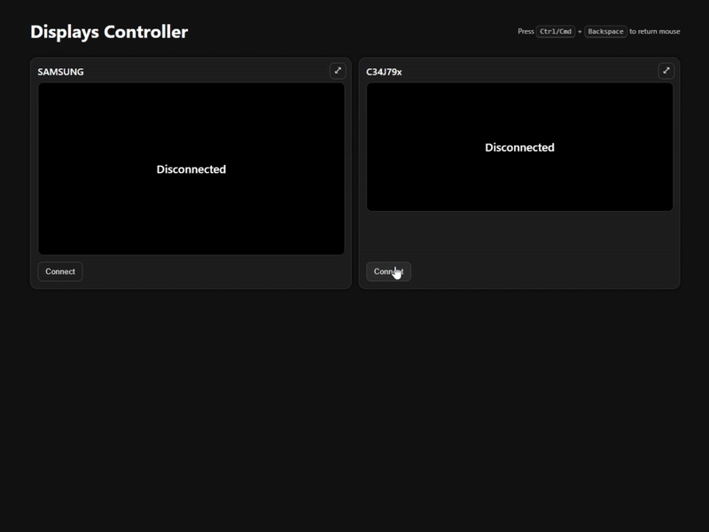
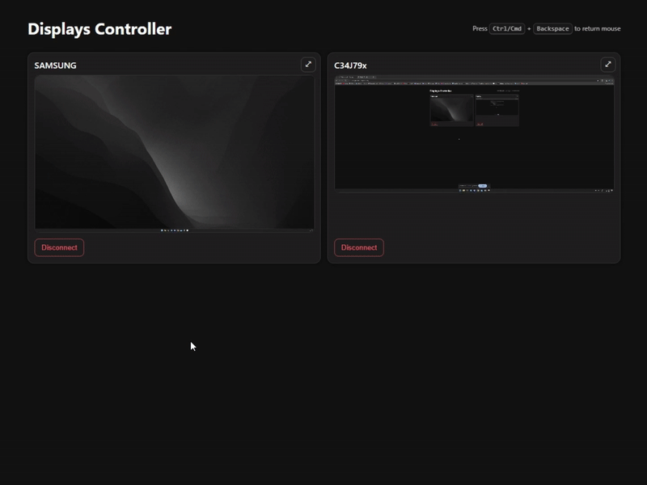
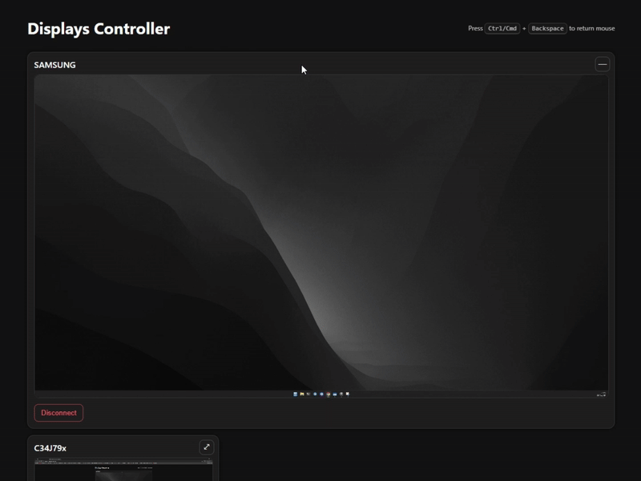
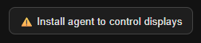

<h1>
  Displays Controller
  
</h1>

#### A tool that makes it easy to **view** and **control** all displays connected to your computer

#### Link to Control Panel: https://svettuff.github.io/DisplaysController/

### Supported Browsers

### Agent Supported Systems

## Usage

### Connect your displays

### Maximize and minimize previews

### Click to control _(p.s. Display is behind my back)_

## Agent Installation

**To control your displays please install simple agent**

Follow this simple steps:

1. Click this button in **[Control Panel](https://svettuff.github.io/DisplaysController/)**

    

2. Open downloaded `.exe` file **"DisplaysControllerAgent"**
3. All is done! Next time it will start automatically